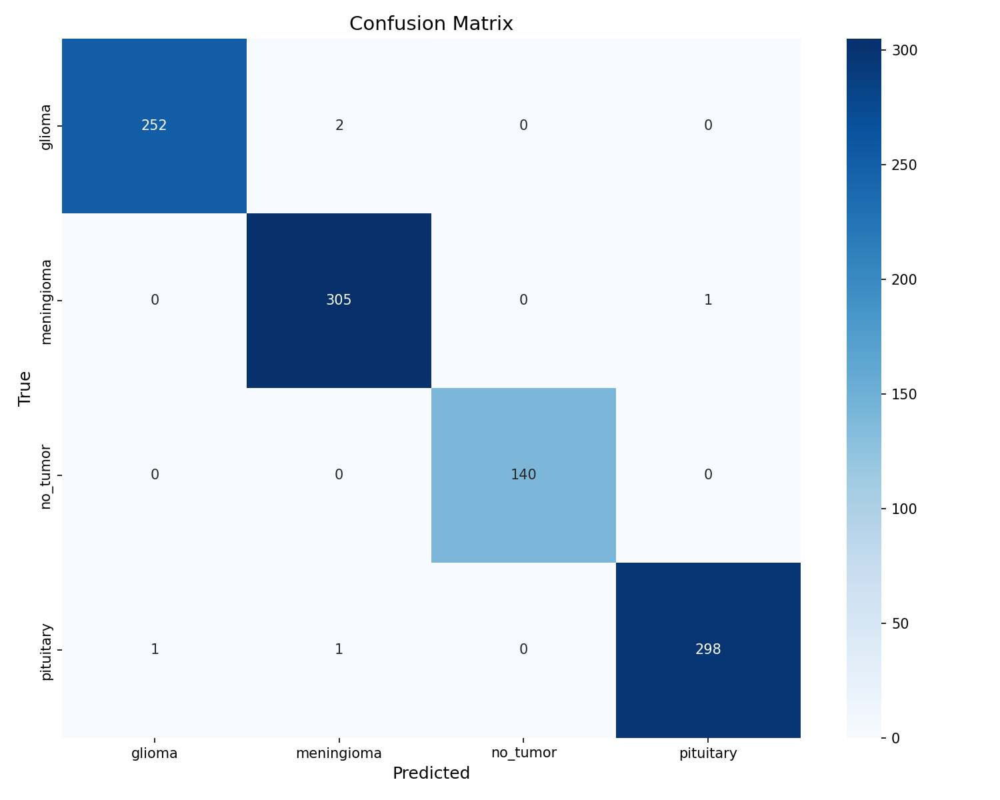

# Intracranial Tumor Classification with the BRISC 2025 dataset
Deep learning project focused in utilizing transfer learning of ResNet for tumor classification from MRI data. The final model classifies 3 distinct types of tumors (Meningioma, Pituitary, Glioma) or the absence of one.

## Installation
**NOTE: TO USE CUDA, DO THE FOLLOWING BEFORE INSTALLING DEPENDENCIES**.  
Install CUDA Toolkit from: https://developer.nvidia.com/cuda-downloads  
You will need to separately install torch using these instructions: https://pytorch.org/get-started/locally/  

**AFTER YOU ARE DONE WITH CUDA INSTALLATION, OR YOU DON'T NEED CUDA**  
Required libraries can be installed from the requirements.txt using command:
```
pip install -r requirements.txt
```

Required project directory structure can be initialized by running the setup.py file with the root directory as the working directory.  
After initializing the structure, dataset should be manually saved in the data folder. args.py can be modified to fit your naming convention.

## Usage  
Most of the adjustable parameters and arguments reside in args.py. You should modify the parameters inside the file itself if you want to change anything.  
Noteworthy arguments for controlling training and evaluation:
```
-resume: boolean for resuming training from checkpoint
-train: boolean for toggling training of k-fold models
-evaluate: boolean for toggling model evaluation
```
These can be beneficial if your training loop terminates suddenly, or you want to only train or evaluate the model.

## Results
Results were achieved using transfer learning on Resnet34 with the default hyperparameters of args.py used.

### Validation
Using k-fold cross validation the following aggregated metrics were collected: (mean ± std)
```
Loss: 0.0361 ± 0.0130
Accuracy: 0.9898 ± 0.0035
Precision (macro): 0.9902 ± 0.0033
Recall (macro): 0.9897 ± 0.0034
F1 Score (macro): 0.9899 ± 0.0033
Cohen's Kappa: 0.9863 ± 0.0047
ROC-AUC (macro): 0.9996 ± 0.0003

Per-class F1: ['0.988', '0.985', '0.994', '0.992'] ± ['0.002', '0.006', '0.003', '0.005']
Per-class Precision: ['0.990', '0.984', '0.996', '0.990'] ± ['0.006', '0.004', '0.005', '0.007']
Per-class Recall: ['0.986', '0.985', '0.992', '0.995'] ± ['0.006', '0.010', '0.004', '0.003']
```
### Evaluation
Soft voting of k-fold ensemble was utilized for evaluation on the held-out test set. 
Metrics of ensemble evaluation:
```
Loss: 0.0215
Accuracy: 0.9957
Precision: 0.9956
Recall: 0.9957
Macro F1 Score: 0.9957
Cohen's Kappa: 0.9932
ROC-AUC Macro: 0.9997
Per-class F1: ['0.994', '0.992', '1.000', '0.997']
Per-class Precision: ['0.992', '0.990', '1.000', '1.000']
Per-class Recall: ['0.996', '0.993', '1.000', '0.993']
```
#### Confusion Matrix of ensemble evaluation:


## Dataset Attribution
This project uses the **BRISC 2025** dataset (https://www.kaggle.com/datasets/briscdataset/brisc2025), 
which is licensed under the Creative Commons Attribution 4.0 International License (CC BY 4.0).
© Amirreza Fateh, Yasin Rezvani, Sara Moayedi, Sadjad Rezvani, Fatemeh Fateh, Mansoor Fateh, Vahid Abolghasemi, 2025.
The dataset is not included in this repository.

## License
This project's **source code** is licensed under the MIT License.
The **dataset** is licensed under the Creative Commons Attribution 4.0 International (CC BY 4.0) license.
